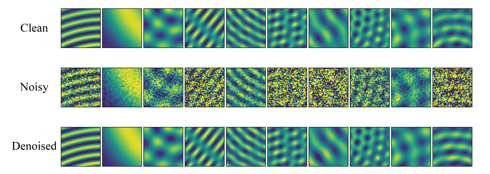

# Deep sound-field denoiser: optically-measured sound-field denoising using deep neural network

Welcome to the official GitHub repository for the Deep Sound-Field Denoiser, a DNN-based denoising method for optically-measured sound fields [1]. This repository contains the codebase and sound-field image dataset used in our paper. You can leverage our pretrained model to denoise your own sound-field images.

For more details, see our [project page](https://www.kenjiishikawa.com/research/deep-acousto-optic-denoiser) and [paper](https://arxiv.org/abs/2304.14923)

## What is deep sound-field denoiser?

The Deep Sound-Field Denoiser is a deep learning model for noise reduction in sound-field images measured by optical methods, such as interferometer and holography. It can also be applied to microphones or simulation data as long as they represent the sound field as an image. It treats the complex-valued amplitude of the sound field in the frequency domain as a 2-channel image consisting of real and imaginary parts, and performs noise reduction using the NAFNet [2]. The network has been trained using a sound-field image dataset we created using 2D acoustic simulations. The dataset includes noisy data with additive Gaussian white noise and noisy data with speckle noise specific to optical systems, allowing you to choose the dataset according to the characteristics of your data. We have confirmed that it exhibits superior noise reduction performances compared to conventional filter-based methods such as Gaussian filter, Non-local means, BM3D, and spatiotemporal band-pass filter.



## Getting started

1. Our method uses NAFNet (Nonlinear Activation Free Network for Image Restoration) [1] as a network. Copy all files in 'basicsr' directory from [here](https://github.com/megvii-research/NAFNet) into your 'basicsr' directory.

2. Download [trained weights](https://zenodo.org/record/8363120) and place them in the 'trained_weights' directory.

3. Download [sound-field-image dataset](https://zenodo.org/record/8357753) and place them in the 'dataset' directory. When you run evaluation.py, 'evaluatation' directory from the dataset is required. When you run train.py, 'training' and 'validation' directories are required.

4. Install dependencies listed on [requirements.txt](requirements.txt).

## Use deep sound-field denoiser

### Quick demo by jupyter notebook

[demo.ipynb](demo.ipynb) provides a simple demo including loading a random sound field from evaluation dataset, denoising by pretrained weights, and displaying true, noisy, and denoised images.

### Evaluation

To evaluate metrics and save denoised data on evaluation dataset, simply run

```sh
python evaluate.py
```

You can specify parameters for evaluation by the properties below 'eval' section in [config.yml](config.yml). The evaluation results will be saved into 'save_dir' directory of 'evaluation' section in the yaml file, a sub directory with the timestamp as its name will be automatically generated. Three models (NAFNet, LRDUNet, DnCNN) and two noises (white and speckle) are provided with their [trained weights](https://zenodo.org/record/8363120).

### Training

To train your model, run

```sh
python train.py
```

You can specify parameters for training by the properties below 'train' and 'validation' sections in [config.yml](config.yml).

## License

Read the NTTSoftwareLicenseAgreement.pdf.

## Reference

[1] K. Ishikawa, D. Takeuchi, N. Harada, and T. Moriya ``Deep sound-field denoiser: optically-measured sound-field denoising using deep neural network,'' arXiv:2304.14923 (2023).

[2] Chen, L., Chu, X., Zhang, X., Sun, J. (2022). Simple Baselines for Image Restoration. In: Avidan, S., Brostow, G., Cissé, M., Farinella, G.M., Hassner, T. (eds) Computer Vision – ECCV 2022. ECCV 2022. Lecture Notes in Computer Science, vol 13667. Springer, Cham. https://doi.org/10.1007/978-3-031-20071-7_2
